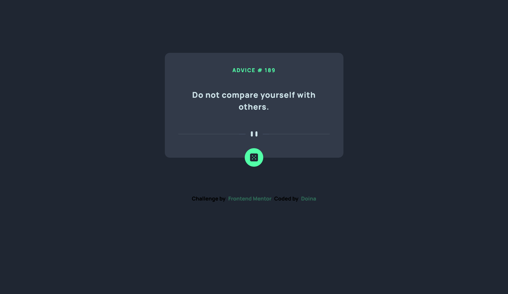

# Frontend Mentor - Advice generator app solution

This is a solution to the [Advice generator app challenge on Frontend Mentor](https://www.frontendmentor.io/challenges/advice-generator-app-QdUG-13db). Frontend Mentor challenges help you improve your coding skills by building realistic projects.

## Table of contents

- [Overview](#overview)
  - [The challenge](#the-challenge)
  - [Screenshot](#screenshot)
  - [Links](#links)
- [My process](#my-process)
  - [Built with](#built-with)
  - [What I learned](#what-i-learned)
  - [Continued development](#continued-development)
  - [Useful resources](#useful-resources)
- [Author](#author)

## Overview

### The challenge

Users should be able to:

- View the optimal layout for the app depending on their device's screen size
- See hover states for all interactive elements on the page
- Generate a new piece of advice by clicking the dice icon

### Screenshot



### Links

- Solution URL: [Add solution URL here](https://your-solution-url.com)
- Live Site URL: (https://doileo.github.io/advice-generator-app/)

## My process

### Built with

- Semantic HTML5 markup
- CSS custom properties
- Flexbox
- CSS Grid
- Mobile-first workflow
- JavaScript

### What I learned

Here are some of the code snippets I used from the resources I listed in the Useful Resources section below:

```css
@media (hover: hover) {
  .dice-image:hover {
    box-shadow: -1px 1px 88px 12px rgba(82, 255, 168, 1);
    transition: all ease-in-out 0.3s;
  }
}
```
```js
'use strict'

diceButton.addEventListener("click", () => {
  //Request Data
  fetch(apiUrl, {cache: "no-cache"})
    .then((response) => response.json())
    .then((response) => {
      let data = response.slip;
      let dataId = data.id;
      let dataAdvice = data.advice;
     //Add to the DOM
      adviceNumber.innerHTML = `advice # ${dataId}`;
      adviceText.innerHTML = dataAdvice;
    });
});
}
```

### Continued development

Using the fetch method is one of the things I need to practice more. After finishing this project, I'd like to make more progress on apps that generate variety of things.

### Useful resources

- [Resource 1](https://www.udemy.com/course/the-complete-javascript-course/) - These days I'm learning the JavaScript stuff from Jonas's course. One of the new things I've learned is how to use "use strict" mode. It's basically used at the top of the script and it works the "modern way".
- [Resource 2](https://www.youtube.com/watch?v=2AfzKmgqWUE) - This is a great video which helped me understand how to use fetch() nethod.


## Author

- Website - [Doina](https://doileo.github.io/portfolio/)
- Frontend Mentor - [@Doileo](https://www.frontendmentor.io/profile/Doileo)
- LinkedIn - (https://www.linkedin.com/in/doinaleovchindeveloper/)

