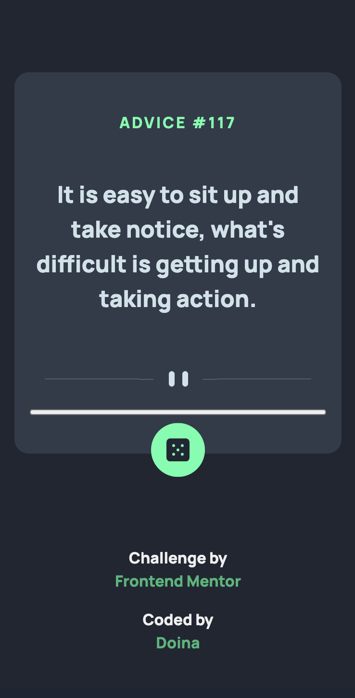
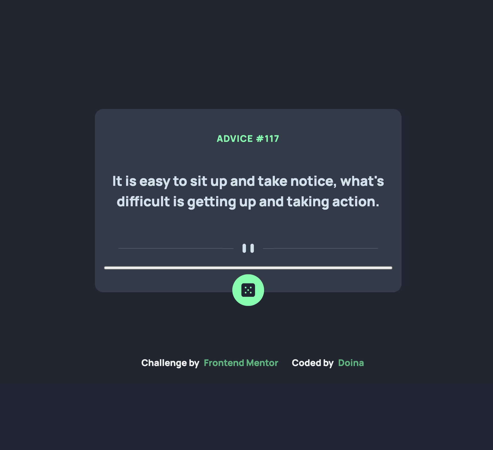
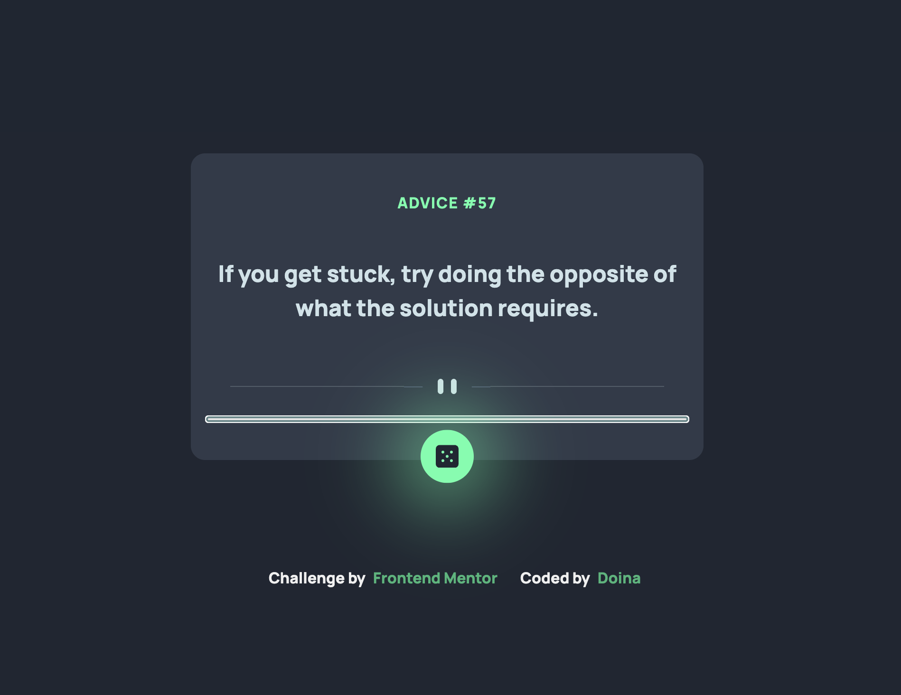

# Frontend Mentor - Advice generator app solution

This is a solution to the [Advice generator app challenge on Frontend Mentor](https://www.frontendmentor.io/challenges/advice-generator-app-QdUG-13db). Frontend Mentor challenges help you improve your coding skills by building realistic projects.
The advice generator app generates a new piece of advice by clicking the dice icon.

## Table of contents

- [Frontend Mentor - Advice generator app solution](#frontend-mentor---advice-generator-app-solution)
  - [Table of contents](#table-of-contents)
  - [Overview](#overview)
    - [The challenge](#the-challenge)
    - [Screenshots](#screenshots)
    - [Links](#links)
  - [My process](#my-process)
    - [Built with](#built-with)
    - [What I learned](#what-i-learned)
    - [Continued development](#continued-development)
    - [Useful resources](#useful-resources)
  - [Installation Instructions](#installation-instructions)
    - [Clone the repository](#clone-the-repository)
    - [Navigate to the project directory](#navigate-to-the-project-directory)
    - [Run the project](#run-the-project)
  - [Dependencies](#dependencies)
  - [Usage Instructions](#usage-instructions)
  - [Project Structure](#project-structure)
    - [Key Files](#key-files)
  - [Author](#author)

## Overview

### The challenge

Users should be able to:

- View the optimal layout for the app depending on their device's screen size
- See hover states for all interactive elements on the page
- Generate a new piece of advice by clicking the dice icon

### Screenshots

| Device      | State        | Screenshot                                                                |
| ----------- | ------------ | ------------------------------------------------------------------------- |
| **Mobile**  | Default View |                        |
| **Desktop** | Default View |      |
| **Desktop** | Hover Effect |  |

### Links

- Solution URL: [Solution URL here](https://www.frontendmentor.io/solutions/advice-generator-app-PwuHpA1QoP)
- Live Site URL: [Live Site URL](https://doileo.github.io/advice-generator-app/)

## My process

### Built with

- Semantic HTML5 markup
- CSS custom properties, Flexbox for styling
- Mobile-first workflow
- JavaScript (ES6+ features such as async/await)
- Fetch API for handling external data
- Accessibility improvements (ARIA labels for interactive elements)

### What I learned

One key takeaway from this project was improving my understanding of async/await for handling API requests. I also learned how to set the aria-label attribute for better accessibility.

Here’s a snippet demonstrating the use of async/await in my API call:

```js
const fetchAdvice = async () => {
  const response = await fetch(apiUrl, { cache: "no-cache" });

  if (!response.ok) {
    throw new Error("Network response was not ok");
  }

  return (await response.json()).slip;
};
```

- Using await to handle asynchronous operations without .then().
- Adding { cache: "no-cache" } to ensure fresh data on each request.
- Handling API response errors gracefully by checking response.ok.

### Continued development

- Further improvements on handling API errors
- Enhancing accessibility features and UI responsiveness
- Experimenting with local storage to save previous advice history

### Useful resources

- [MDN Web Docs - Fetch API](https://developer.mozilla.org/en-US/docs/Web/API/Fetch_API) - Helped in understanding how to work with `async/await` and error handling in API requests.
- [MDN Web Docs - ARIA Labels](https://developer.mozilla.org/en-US/docs/Web/Accessibility/ARIA/Attributes/aria-label) - Used to improve accessibility by adding meaningful labels to interactive elements.
- [JavaScript.info - Async/Await](https://javascript.info/async-await) - A great explanation of how to use async functions effectively.

## Installation Instructions

### Clone the repository

To get started, clone the repository using the following command:

```sh
git clone https://github.com/doileo/advice-generator-app.git
```

### Navigate to the project directory

After cloning the repository, move into the project folder using the following command:

```sh
cd advice-generator-app
```

### Run the project

Open `index.html` directly in your browser, or use a live server extension in your code editor for a better development experience.

## Dependencies

This project does not require any external dependencies. It runs using:

- Vanilla JavaScript
- HTML
- CSS

## Usage Instructions

1. Open the app in your browser.
2. Click the dice icon to generate a new piece of advice.
3. Enjoy the randomly generated wisdom!

## Project Structure

### Key Files

- `index.html` - Main HTML structure
- `main.css` - Styling for the app
- `main.js` - JavaScript functionality
- `images/` - Folder containing icons and screenshots

## Author

- Frontend Mentor - [@Doileo](https://www.frontendmentor.io/profile/Doileo)
- LinkedIn - [Doina Leovchin](https://www.linkedin.com/in/doinaleovchindeveloper/)
